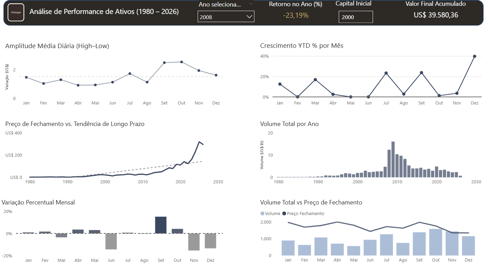
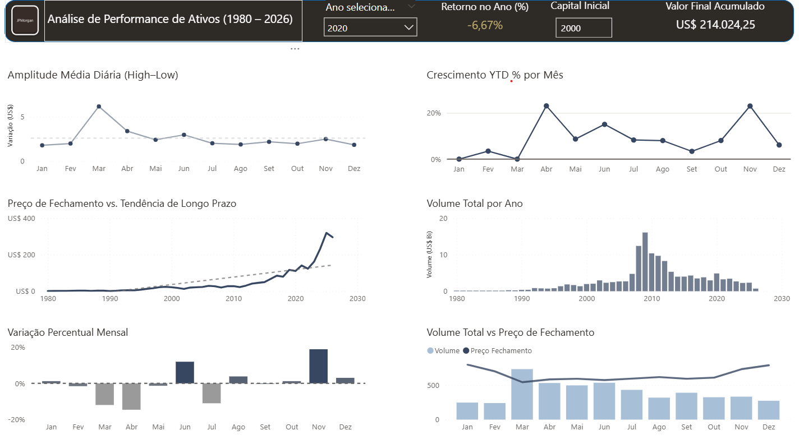
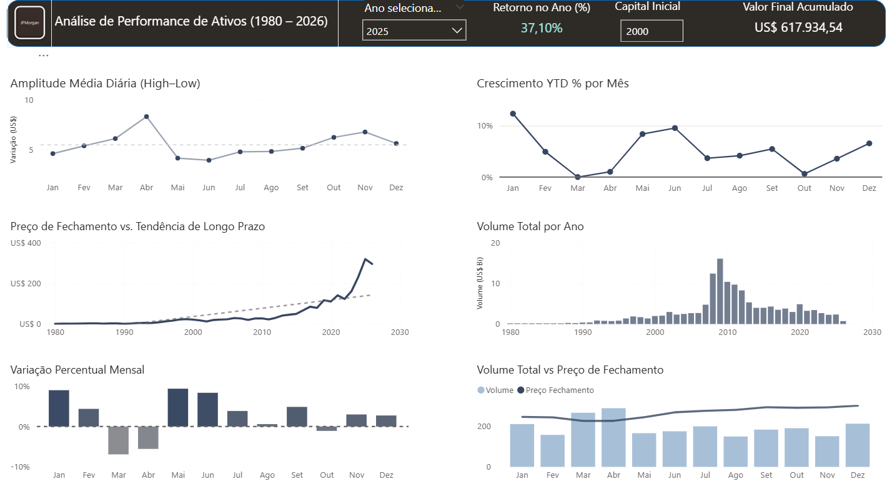

# Análise Histórica de Performance de Ativos (JPMorgan Chase) 

## 📌 Objetivo
Desenvolvimento de um dashboard interativo em Power BI focado na análise do comportamento histórico dos ativos da JPMorgan (1980–2026). A solução visa transformar dados brutos de mercado em inteligência visual para apoiar a avaliação de rentabilidade, volatilidade de preços e liquidez em diferentes cenários econômicos.

## 📸 Visualização do Painel

*Print completo do painel interativo destacando os indicadores anuais, filtros dinâmicos e visões mensais do ativo.*

## 📊 Indicadores e Métricas Mapeadas
* **Retorno no Ano (%)** (Métrica dinâmica que calcula o rendimento do ativo no ano selecionado).
* **Valor Final Acumulado** (Resultado da simulação com base no capital inicial).
* **Capital Inicial** (Parâmetro interativo inserido pelo usuário para simulações).
* **Crescimento YTD % por Mês** (*Year-to-Date* - velocidade do acúmulo de ganho ao longo dos meses).
* **Amplitude Média Diária** (Termômetro de volatilidade baseado na distância entre as máximas e mínimas - *High-Low*).
* **Volume Total por Ano** (Métrica de liquidez e fluxo de negociação a longo prazo).
* **Variação Percentual Mensal** (Performance isolada de cada mês do ano).
* **Volume Total vs. Preço de Fechamento** (Análise combinada de fluxo financeiro contra tendência de preço).

## 🛠️ Tecnologias e Conceitos Aplicados
* **Power BI Desktop:** Construção integral do ecossistema de análise.
* **Modelagem de Dados:** Estruturação de tabelas e relacionamentos eficientes.
* **Linguagem DAX:** Criação de medidas calculadas e inteligência de tempo para análises comparativas.
* **Design de Dashboards (UX/UI):** Criação de uma interface limpa, intuitiva e estruturada sob princípios de Storytelling de Dados e clareza visual.

## ⚠️ Observações Técnicas
* Os dados do ano de 2026 estão disponíveis e atualizados até o mês de abril.
* O dashboard inclui uma funcionalidade exclusiva de simulação de investimentos com base em um capital inicial totalmente personalizado pelo usuário.

## 📊 Estrutura e Mecânica dos Gráficos

💡 Clique aqui para entender o que cada gráfico do painel analisa (Sem Spoiler)
 

Para mapear a saúde financeira e o comportamento dos ativos da JPMorgan, este dashboard foi estruturado a partir de seis visões complementares:

* **Amplitude Média Diária (High–Low):** Atua como o nosso indicador direto de risco e volatilidade prática, calculando o distanciamento entre as máximas e mínimas diárias para apontar períodos de forte agitação de mercado.
* **Crescimento YTD % por Mês (Year To Date):** Monitora a velocidade e o acúmulo da rentabilidade desde o início de janeiro até o mês corrente, facilitando a identificação exata do trimestre onde o ativo ganhou tração.
* **Preço de Fechamento vs. Tendência de Longo Prazo:** Mostra a evolução histórica do valor da ação ao longo das décadas e valida visualmente o princípio de resiliência e recuperação do banco após ciclos de baixa.
* **Volume Total por Ano:** Mede a quantidade total de ações negociadas ano a ano, servindo como um termômetro para identificar picos de movimentação e o comportamento do investidor em cenários de instabilidade.
* **Variação Percentual Mensal:** Revela como as oscilações acontecem na escala mensal, permitindo identificar que o desempenho do mercado não é linear e apresenta picos isolados de alta ou baixa mesmo em anos difíceis.
* **Volume Total vs. Preço de Fechamento:** Um gráfico combinado que cruza a liquidez com a linha de preço para diagnosticar se uma tendência de alta ou de baixa é sustentável e apoiada por fluxo institucional de capital.

--- 

### 🔍 Estudos de Caso Práticos (Navegando pelo Dashboard)

Para validar a utilidade prática das métricas desenvolvidas, utilizei os filtros do painel para isolar e analisar  três momentos históricos distintos da instituição:

### 1️⃣ Crise Financeira Global (Estudo de Caso: 2008)
*(Análise baseada na imagem principal demonstrada no topo deste repositório)*

* **Constatação Visual:** No gráfico de longo prazo...
* **Constatação Visual:** No gráfico de longo prazo, o preço das ações tendeu a "andar de lado", apresentando uma leve queda seguida de estabilização. Em contrapartida, o gráfico de *Volume Total por Ano* registrou um salto massivo, atingindo picos históricos entre 2008 e 2010. Ao nível mensal, o gráfico de *Variação Percentual Mensal* mostra que o ano fechou com saldo negativo de -23,19%, mas com oscilações intensas e picos isolados de alta em meses específicos, como Setembro.
* **Contexto de Negócio:** Esse padrão reflete o comportamento típico de mercado durante a Crise do *Subprime*. O pico drástico de volume indica uma busca extrema por liquidez e realocação de capital por parte dos investidores (pânico e negociação em massa). A estabilidade relativa do preço do JPM, enquanto concorrentes gigantes faliam na mesma época, reforça a sólida resiliência institucional do JPMorgan frente ao colapso do sistema bancário.

#### 😷 2️⃣ Choque Global Repentino e Recuperação em "V" (Estudo de Caso: 2020)

📸 Clique aqui para ver o Dashboard filtrado em 2020

 

* **Constatação Visual:** O gráfico de *Variação Percentual Mensal* desenhou o clássico efeito de "Montanha-Russa". Registrou-se um recuo severo no primeiro quadrimestre, com quedas consecutivas de -11,9% em março e um agravamento para -14,6% em abril. No mesmo período, o gráfico de *Amplitude Média Diária* disparou significativamente acima da linha tracejada de média. Já o mês de novembro apresentou uma virada espetacular com uma alta isolada de +20,2%.
* **Contexto de Negócio:** Este comportamento traduz visualmente o impacto da pandemia da COVID-19 e o conceito prático de volatilidade. O colapso e a forte agitação de preços (High-Low) em março e abril refletem o pânico macroeconômico e a paralisação da economia com o início dos *lockdowns* mundiais. Por outro lado, a forte valorização e quebra de tendência em novembro quantificam o otimismo imediato dos investidores e a reação direta do mercado financeiro ao anúncio da eficácia das primeiras vacinas globais.

#### 🚀 3️⃣ Ciclo de Expansão e Maturidade de Mercado (Estudo de Caso: 2025)

📸 Clique aqui para ver o Dashboard filtrado em 2025

* **Constatação Visual:** O indicador de *Retorno no Ano (%)* consolidou-se fortemente no campo positivo, atingindo uma valorização expressiva de 37,10%. O gráfico de *Crescimento YTD % por Mês* desenhando uma trajetória de ascensão contínua e linear (como uma escada para cima), interrompida apenas por breves correções saudáveis. Diferente dos anos de crise, as colunas de volume mantiveram-se estáveis, previsíveis e próximas à média histórica.
* **Contexto de Negócio:** Este padrão representa um ambiente clássico de *Bull Market* (mercado em alta) saudável e sustentável. A valorização expressiva do preço de fechamento, sem a necessidade de uma explosão desordenada no volume de transações, indica que a alta é movida por confiança institucional genuína e solidez nos fundamentos econômicos do banco, e não por especulação barata ou pânico de liquidez.

## 📈 Conclusão do Projeto e Aprendizado

Este projeto foi essencial para o meu amadurecimento na entrega de inteligência de negócios. Ele me deu a oportunidade de ir além da teoria e aplicar na prática conceitos importantes de modelagem de dados e análise visual com Power BI e DAX.

Durante o desenvolvimento, meus principais focos foram:
* **Entender as conexões e filtros:** Aprender como os segmentadores influenciam os gráficos e como travar ou liberar os contextos de filtro para que as análises históricas não quebrassem.
* **Praticar a leitura analítica:** Treinar o olhar técnico para identificar anomalias, grandes correções e picos de volume, traduzindo o comportamento visual em respostas de negócio.
* **Organização e Storytelling:** Criar um layout limpo e corporativo, combinando visuais mensais e de longo prazo sem poluir a tela, garantindo uma leitura fluida para o usuário.

Este primeiro projeto fortalece os meus primeiros passos técnicos e me dá muito mais segurança para continuar estudando, desenvolvendo novos modelos e avançando na análise de dados.
